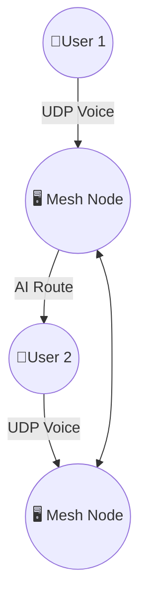

````markdown
# MeshTalk 🚀🔐📡

**Quantum-Resistant, AI-Powered Offline Mesh Communication System**

MeshTalk is a decentralized, offline-capable voice and text communication platform designed for mission-critical, internet-free environments. It operates over WiFi/Bluetooth mesh networks using military-grade encryption and cutting-edge AI for real-time noise reduction and command recognition.

---

## 🌟 Features

- 📶 Offline Mesh Networking (via BATMAN-Adv over WiFi/Bluetooth)
- 🔐 Post-Quantum Encryption (CRYSTALS-Kyber + XChaCha20)
- 🧠 AI-Powered Noise Cancellation (RNNoise)
- 🗣️ Offline Voice Commands (via Vosk)
- 🌍 Flutter Frontend with walkie-talkie UI and mesh visualization
- ⚡ <100ms Voice Latency, fully peer-to-peer
- 🧱 Zero Central Servers, ephemeral identity, no phone numbers/IP logging

---

## 🛠️ Tech Stack

| Layer         | Tech Used                            |
|--------------|---------------------------------------|
| Mesh Routing | BATMAN-Adv (Linux kernel module)      |
| Transport    | UDP (voice) + TCP (signaling)         |
| Security     | CRYSTALS-Kyber, XChaCha20             |
| AI Features  | RNNoise, Vosk, TinyML                 |
| Frontend     | Flutter (Android/iOS/Desktop)         |

---

## 🔧 Setup Instructions

### ⚙️ Python Backend

> Requires Linux (for BATMAN-Adv), Python 3.9+, libsodium, etc.

```bash
cd server/
pip install -r requirements.txt
sudo modprobe batman-adv
python mesh_relay.py
````

### 📱 Flutter Frontend

> Requires Flutter 3.13+, Android Studio or VS Code

```bash
cd flutter/
flutter pub get
flutter run
```

---

## 🧪 MVP Strategy

> Team of 3 developers (Flutter / Python / AI)

### ⏱️ Week 1:

* Set up mesh routing and encryption backend
* Implement Flutter walkie-talkie interface

### ⏱️ Week 2:

* Integrate AI noise reduction + voice commands
* Visualize mesh map and test on Raspberry Pi cluster

---

## 🧠 AI Capabilities

| Feature          | Tool    | Purpose                       |
| ---------------- | ------- | ----------------------------- |
| Noise Removal    | RNNoise | Real-time mic cleanup         |
| Voice Commands   | Vosk    | Offline SOS + control phrases |
| Route Prediction | TinyML  | Best path prediction in mesh  |

---

## 🎨 Design Language

* **Logo**: Hexagon mesh + soundwave (purple/green gradient)
* **UI Theme**: Dark mode with neon highlights
* **Font**: Fira Code (tech monospace)

---

## 💰 Monetization Options

| Offering                   | Price / Value        |
| -------------------------- | -------------------- |
| B2B API for military use   | \$500K/license       |
| Freemium app model         | \$3/month SOS beacon |
| White-label SDK for telcos | Custom pricing       |

---

## 📜 License

This project is under the **MIT License**.

---

## 🧭 Roadmap

* ✅ MVP on LAN-only mesh
* ⬜ Deploy on Raspberry Pi mesh cluster
* ⬜ Voice-to-voice SOS demo
* ⬜ Add white-label configuration mode
* ⬜ Replit cloud simulator

---

## 📊 Architecture Diagram (Mermaid.js)



---

## 🧠 Contributing

Want to help expand MeshTalk?

1. Fork the repo
2. Create a feature branch:

   ```bash
   git checkout -b feat/your-feature-name
   ```
3. Commit your changes
4. Submit a Pull Request 🙌

---

## 📞 Contact

For commercial inquiries or access to investor materials, please email:
📩 **[alvinbijo6@gmail.com](mailto:alvinbijo6@gmail.com)**

---

## ⭐ Star This Project

If this project inspires you, [give it a ⭐ on GitHub](https://github.com/OffgridOps/MeshTalk)!

Let’s build resilient communication for everyone, everywhere. 🌍🔒

---

